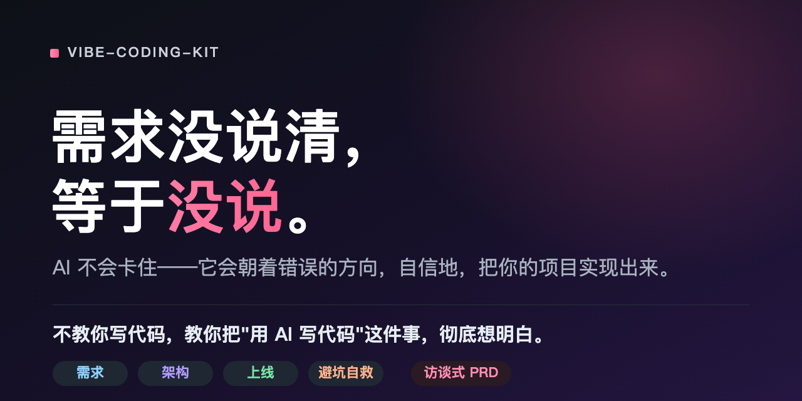
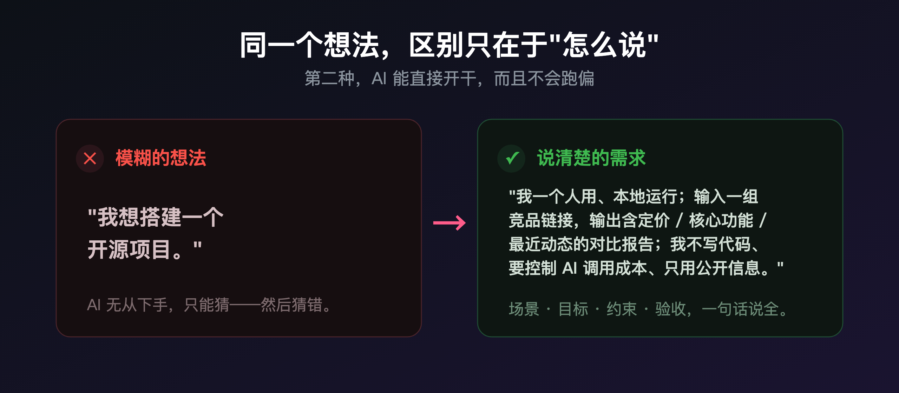
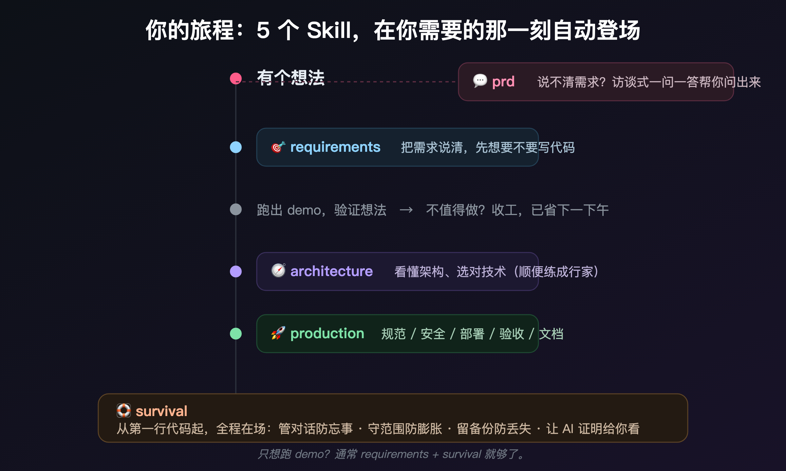

<div align="center">



# vibe-coding-kit

**不教你写代码，教你把"用 AI 写代码"这件事，彻底想明白。**

*A planning toolkit for vibe coders who don't (yet) write code.*


</div>

---

> **需求没说清，等于没说。** AI 不会卡住——它会朝着错误的方向，飞速地、自信地，把你的项目实现出来。

如今谁都能把一个想法甩给 AI，几分钟跑出个能动的东西。但真正把它做成、做对、不半路崩掉的人，少得多。差距从来不在"会不会调 AI"，而在两件事：**开工前有没有把需求想清楚，开工后有没有守住纪律。**

这套工具，就是把这两件事，拆成任何人都能照着做的步骤。

---

## 它解决什么

你大概经历过其中至少一种：

- 想法很清楚，AI 写出来的却完全不是那回事，来回扯皮一下午。
- demo 跑通了，越改越乱，最后连之前能用的版本都找不回来了。
- AI 信誓旦旦说"已完成"，你一跑，根本不行。
- 面对它给的几个技术方案，你一个字都看不懂，只能闭眼选一个。

这些都不是技术问题，是**方法问题**。而方法，是可以学的。

## 30 秒看懂它的价值

同一个人，同一个想法，区别只在于"怎么说"：

<div align="center">

</div>

第二种，AI 能**直接开干，而且不会跑偏**。本套件做的，就是带你从第一种，走到第二种——并且一路护送到上线。

## 套件里有什么

五个轻量 Skill，**在你需要的那一刻，自动登场**：

| Skill | 什么时候用 | 给你什么 |
|-------|-----------|---------|
| 💬 **prd** | "帮我理需求" / "帮我写个 PRD" / 想清楚再开工 | **访谈式 Agent**：先做竞品+开源调研，一问一答 + 岔路口给建议，产出三件套（PRD + 交互图 + 开发文档） |
| 🎯 **requirements** | "我想做个 X" / 跑 demo / 对齐需求 | 该不该写代码的自检 + 需求四要素 + 把需求补全 |
| 🧭 **architecture** | 选技术栈 / 看不懂 AI 给的方案 | 看懂任何架构的 **6 个维度** + 选型五步法 |
| 🚀 **production** | demo 想做成正式系统 / 部署上线 | 开发规范 + 安全基线 + 部署 + 验收 + 文档 |
| 🛟 **survival** | "AI 越改越乱" / 改坏退不回去 / AI 忘事 | 贯穿全程四件事 + 红线 + 项目说明书 |

> **不知道从何说起？** 在 Claude Code / Codex 里直接用 `prd` 这个**访谈 Agent**——它会先帮你做竞品和开源调研（确认值不值得做、有没有现成的能用），再像产品顾问一样一点点问你，在你判断不了的地方（尤其"这东西该活在哪""用什么技术"）给你选项和推荐，最后把**三件套**（`1-PRD.md` 做什么 + `2-交互图.html` 长什么样 + `3-开发文档.md` 怎么做）写进你的项目目录。

## 你的旅程

<div align="center">

</div>

## 不止于"做完"——把小白带成行家

大多数工具教你"怎么用 AI 把事办成"。这套件多走一步：**让你逐步看懂自己在做什么。**

`architecture` 里的「6 个维度」和「把 AI 当老师」，不是让你照搬话术，而是让你学会**拷问任何方案**——数据存哪、谁在跑、依赖几何、值不值这个复杂度。用上几个项目，你会发现自己不再需要话术,因为你已经能一眼看穿方案的好坏。

> 这才是它和"又一个 prompt 合集"的根本区别。

## 快速开始

每个 Skill 就是一个含 `SKILL.md` 的文件夹——这是通用的 Skill 格式。下面三种用法，**从最省事到最进阶**，挑一个适合你的：

### 方式一 · 零安装，复制即用（最简单，人人都会）★ 推荐先用这个

不想折腾任何设置，30 秒就能试：

1. 打开本仓库，进 `skills/` 里你想用的那个文件夹（不知道选哪个？先用 `vibe-coding-requirements`）。
2. 点开里面的 `SKILL.md`，**全选复制**全部内容。
3. 回到你和 AI 的对话框（Claude、ChatGPT、Codex 都行），**粘贴进去**，再补一句"请按上面这套方法帮我"。

就这样，立刻能用。先把它跑顺，确认有用了，再考虑下面更省心的方式。

### 方式二 · Claude 网页/桌面版：上传成自定义 Skill

如果你常用 [claude.ai](https://claude.ai) 网页版或桌面 App（需要 Pro 及以上套餐）：

1. 先把整个仓库下载到本地：点页面右上角绿色 **Code → Download ZIP**，解压。
2. 在 Claude 里进入 **Settings（设置）→ Capabilities / Skills（技能）**。
3. 选择上传自定义 Skill，把 `skills/` 下你要用的那个文件夹（含 `SKILL.md`）传上去。
4. 之后在对话里它会**在合适的时机自动登场**，不用每次再贴。

### 方式三 · Claude Code：放进 skills 文件夹

如果你用命令行版的 Claude Code：

```bash
# 1. 下载仓库
git clone https://github.com/Junliu1066/vibe-coding-kit.git

# 2. 把需要的 skill 复制到 Claude Code 的个人 skills 目录
cp -R vibe-coding-kit/skills/vibe-coding-requirements ~/.claude/skills/
# 想全装就把整个 skills 目录下的文件夹都复制过去
```

放好后重启 Claude Code，它会自动识别；你描述需求时对应 skill 会自动触发。

> **说明：** 各端的菜单名称和入口可能随版本更新而微调，如与上文略有出入，请以官方最新文档为准：[docs.claude.com](https://docs.claude.com) ・ [support.claude.com](https://support.claude.com)。**拿不准就用「方式一」**，它永远有效。

## 先看一个真实案例

[`examples/案例-竞品调研助手.md`](./examples/案例-竞品调研助手.md) 用一个完整项目——**竞品调研助手**——带你从一句话想法走到能用：

- 五步选型法**实际砍掉了哪几个方案**，为什么
- 6 个维度照出了这个项目真正的风险（提示：是 AI 接口的成本与密钥）
- 哪些诱人的功能被"以后再说"清单挡在了门外
- 红线自检如何判断"这事我能不能放心自己干"

强烈建议先读它，再上手自己的项目。

## 设计信条

这套件有脾气。它信奉：

- **复杂度是负债，不是资产。** 每多一个组件、一个依赖，都是向未来借债。
- **先说问题，再说方案。** 描述方案会锁死 AI，描述问题才有更优解。
- **没有代价的方案不存在。** 不跟你讲代价的推荐，不可信。
- **知道边界，也是本事。** 有些事（动钱、动别人隐私）该找真人——这不是认怂，是行家。
- **维护成本是最终裁决。** 一年后你还修不修得动，比什么都重要。

## 适合谁

- 不写代码、或刚起步，靠 AI 把想法变成产品的产品经理、创业者、独立开发者。
- 想先跑个 demo 验证，又怕跑偏、怕烂尾的人。
- 想借着每个项目，真正把技术判断力练出来的人。

## 参与共建

欢迎 Issue 和 PR：补充话术、修正不准的地方、贡献新的真实案例。改动时请守住这套件的脾气——**大白话、讲代价、不堆复杂度。**

## License

[MIT](./LICENSE)。自由使用、修改、再分发。

---

<div align="center">

**少走弯路，是最被低估的生产力。**

如果它帮到了你，点个 ⭐ 让更多人少走弯路。

</div>
